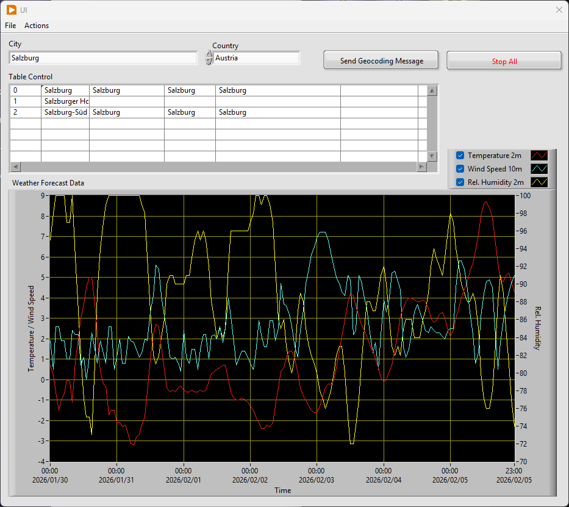

# Weather API - LabVIEW Actor Framework

This repository contains an implementation of the [Weather API Challenge](https://roadmap.sh/projects/weather-api-wrapper-service) from roadmap.sh. The goal is to provide a wrapper service for weather data that receives requests, consumes external weather APIs, and processes the results efficiently.

The unique highlight of this project is the use of **NI LabVIEW** and the **Actor Framework** to create a scalable, object-oriented, and modular architecture.

## Demo-Video

Klick auf das Vorschaubild, um die Anwendung in Aktion zu sehen:
[](./Ressources/WeatherUI_Project.mp4)

## Architecture & Features

The project is based on the **Actor Model**, which enables a clean separation of concerns:

- **Modularity:** Each service (e.g., the Weather Client) runs as an independent Actor.
- **Fault Tolerance:** Utilizes the built-in error-handling mechanisms of the Actor Framework to monitor processes.
- **REST Integration:** Connection to external weather providers via HTTP requests.
- **JSON Parsing:** Fast and reliable data processing of API responses.

## Prerequisites

To run or further develop this project, the following components are required:

1. **LabVIEW:** Version 2020 or newer is recommended.
2. **JKI JSON Library:** This library is mandatory for parsing weather data.
   * The easiest way to install it is via the [JKI VI Package Manager (VIPM)](https://www.vipm.io/package/jki_lib_json_serialization/)).
3. **Actor Framework:** Included by default in LabVIEW.

## Project Structure

The repository is organized according to best practices for LabVIEW projects:

- `Weather API.lvproj`: The main LabVIEW project file.
- `Weather Actor.lvclass`: Contains the logic for retrieving and processing weather data.
- `Messages`: Contains specific Actor messages for communication between components.
- `Documentation`: (If available) Contains diagrams of the Actor hierarchy.

## Installation & Usage

1. **Clone the repository:**

   ```Bash
   git clone https://github.com/HaraldBraun/weatherapi.git
   ```
2. **Check dependencies:** Ensure the JKI JSON library is installed via VIPM.
3. **Open the project:** Launch the Weather API.lvproj file in LabVIEW.
4. **Start the Splash Screen VI:** Locate the main entry point in the Project Explorer (usually Main.vi or the Root Actor) and run it.

## Configuration

The program requires a valid API key from a weather service provider (e.g., Visual Crossing or OpenWeatherMap). This key can be stored in the initialization parameters of the Weather Actor.  

## Roadmap.sh Challenge

This project covers the following requirements of the challenge:

- [x] Fetching weather data via an external API.
- [x] Caching logic for API responses (optional/in progress).
- [x] Console- or GUI-based output of results.

---

Developed by [Harald Braun - LinkedIn](https://www.linkedin.com/in/harald-ludwig-braun).
